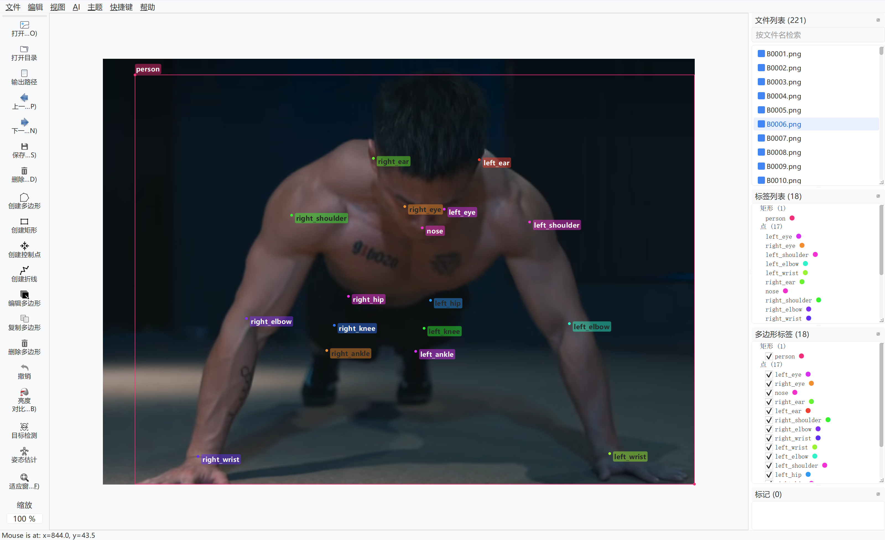
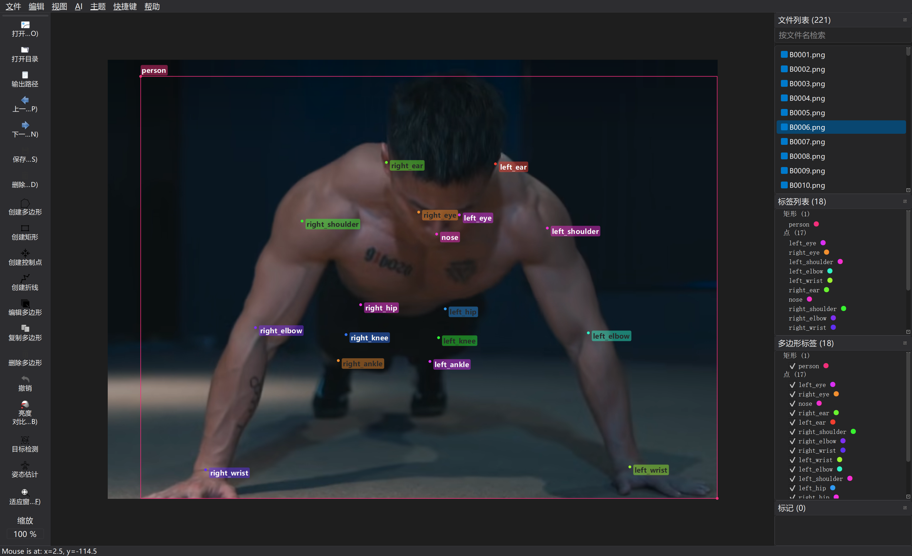

<h1 align="center">
  <br/>labelu
</h1>u
<h4 align="center">
  Image Polygonal Annotation with Python
</h4>

<table>
	<tr>
		<td>
			
		</td>
		<td> 
			
		</td>
	</tr>
</table>
### 使用方法

1. clone 项目到本地

    ```bash
    git clone https://github.com/SprInec/labelme.git
    cd labelme
    ```

2. 本地安装

    ```bash
    pip install -e .
    ```

3. 命令行启动

    ```
    python ./labelme/__main__.py
    # or
    labelme
    ```

> [!tip]
>
> 若是报错缺少什么包，请通过 `pip` 自行根据报错信息安装

### 功能优化与新增

- 更新了大部分 UI 图标，功能指意更明确

- 设计了明暗两种主题，界面风格现代、简约，美观

- <mark>视图</mark>菜单新增<mark>显示标签名称</mark>选项，开启后可在画面中显示标签名称

- 添加了软件开启后自动打开上次所用工作区的功能

- 优化了标签窗口布局与大小，更改其默认打开位置为屏幕中心

- 添加了标签颜色更改功能

- 新增了<mark>AI</mark>菜单，可在该菜单的设置选项中完成半自动标注AI模型的相关配置

- 工具栏的AI相关工具移动到了<mark>AI</mark>菜单下

- 实现了基于 torch 的半自动化标注

    - 目标检测半自动标注
        - Faster R-CNN ResNet-50 FPN
        - Mask R-CNN ResNet-50 FPN
        - RetinaNet ResNet-50 FPN
    - 人体姿态检测半自动标注
        - keypointrcnn_resnet50_fpn

- 优化了标签被选中时的强调效果

- 优化了<mark>创建矩形</mark>工具辅助线的颜色

- 新增了<mark>标签列表</mark>和<mark>多边形标签</mark>窗口的类别分类功能

- 新增了<mark>快捷键</mark>菜单，可自定义相关操作快捷键

- 优化了工具栏布局，实现了分离、四周停靠等布局效果

- 在工具栏中新增了一些常用操作

- <mark>自动保存</mark>更改为默认开启

- <mark>同时保存图像数据</mark>更改为默认关闭

- 更改了标签随机颜色生成效果，更改为更鲜艳的颜色便于分辨

- 新增了画面框选功能，可通过鼠标在画面中同时框选中多个标签进行管理

- 优化了<mark>文件列表</mark>项的名称显示，取消了路径信息

- 实现了<mark>文件列表</mark>、<mark>标签列表</mark>、<mark>多边形标签</mark>、<mark>标记</mark>的数量统计功能

    

> [!caution]
>
> 当前 AI Mask 功能存在问题，请暂时不要使用

### Todo

- 修复 `Ctrl+Z` 无法撤销且卡死的问题
- 标签窗口中标签以标签样式显示设计
- 优化半自动标注效果及工作流
- 修复 AI Mask 无法使用的问题
